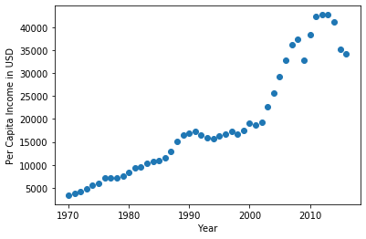

```python
import pandas as pd
import matplotlib.pyplot as plt
from sklearn import linear_model

```


```python
df = pd.read_csv("prec.csv")
df
```


<div>
<style scoped>
    .dataframe tbody tr th:only-of-type {
        vertical-align: middle;
    }

    .dataframe tbody tr th {
        vertical-align: top;
    }

    .dataframe thead th {
        text-align: right;
    }
</style>
<table border="1" class="dataframe">
  <thead>
    <tr style="text-align: right;">
      <th></th>
      <th>year</th>
      <th>per_capita_income_USD</th>
    </tr>
  </thead>
  <tbody>
    <tr>
      <th>0</th>
      <td>1970</td>
      <td>3399.299037</td>
    </tr>
    <tr>
      <th>1</th>
      <td>1971</td>
      <td>3768.297935</td>
    </tr>
    <tr>
      <th>2</th>
      <td>1972</td>
      <td>4251.175484</td>
    </tr>
    <tr>
      <th>3</th>
      <td>1973</td>
      <td>4804.463248</td>
    </tr>
    <tr>
      <th>4</th>
      <td>1974</td>
      <td>5576.514583</td>
    </tr>
    <tr>
      <th>5</th>
      <td>1975</td>
      <td>5998.144346</td>
    </tr>
    <tr>
      <th>6</th>
      <td>1976</td>
      <td>7062.131392</td>
    </tr>
    <tr>
      <th>7</th>
      <td>1977</td>
      <td>7100.126170</td>
    </tr>
    <tr>
      <th>8</th>
      <td>1978</td>
      <td>7247.967035</td>
    </tr>
    <tr>
      <th>9</th>
      <td>1979</td>
      <td>7602.912681</td>
    </tr>
    <tr>
      <th>10</th>
      <td>1980</td>
      <td>8355.968120</td>
    </tr>
    <tr>
      <th>11</th>
      <td>1981</td>
      <td>9434.390652</td>
    </tr>
    <tr>
      <th>12</th>
      <td>1982</td>
      <td>9619.438377</td>
    </tr>
    <tr>
      <th>13</th>
      <td>1983</td>
      <td>10416.536590</td>
    </tr>
    <tr>
      <th>14</th>
      <td>1984</td>
      <td>10790.328720</td>
    </tr>
    <tr>
      <th>15</th>
      <td>1985</td>
      <td>11018.955850</td>
    </tr>
    <tr>
      <th>16</th>
      <td>1986</td>
      <td>11482.891530</td>
    </tr>
    <tr>
      <th>17</th>
      <td>1987</td>
      <td>12974.806620</td>
    </tr>
    <tr>
      <th>18</th>
      <td>1988</td>
      <td>15080.283450</td>
    </tr>
    <tr>
      <th>19</th>
      <td>1989</td>
      <td>16426.725480</td>
    </tr>
    <tr>
      <th>20</th>
      <td>1990</td>
      <td>16838.673200</td>
    </tr>
    <tr>
      <th>21</th>
      <td>1991</td>
      <td>17266.097690</td>
    </tr>
    <tr>
      <th>22</th>
      <td>1992</td>
      <td>16412.083090</td>
    </tr>
    <tr>
      <th>23</th>
      <td>1993</td>
      <td>15875.586730</td>
    </tr>
    <tr>
      <th>24</th>
      <td>1994</td>
      <td>15755.820270</td>
    </tr>
    <tr>
      <th>25</th>
      <td>1995</td>
      <td>16369.317250</td>
    </tr>
    <tr>
      <th>26</th>
      <td>1996</td>
      <td>16699.826680</td>
    </tr>
    <tr>
      <th>27</th>
      <td>1997</td>
      <td>17310.757750</td>
    </tr>
    <tr>
      <th>28</th>
      <td>1998</td>
      <td>16622.671870</td>
    </tr>
    <tr>
      <th>29</th>
      <td>1999</td>
      <td>17581.024140</td>
    </tr>
    <tr>
      <th>30</th>
      <td>2000</td>
      <td>18987.382410</td>
    </tr>
    <tr>
      <th>31</th>
      <td>2001</td>
      <td>18601.397240</td>
    </tr>
    <tr>
      <th>32</th>
      <td>2002</td>
      <td>19232.175560</td>
    </tr>
    <tr>
      <th>33</th>
      <td>2003</td>
      <td>22739.426280</td>
    </tr>
    <tr>
      <th>34</th>
      <td>2004</td>
      <td>25719.147150</td>
    </tr>
    <tr>
      <th>35</th>
      <td>2005</td>
      <td>29198.055690</td>
    </tr>
    <tr>
      <th>36</th>
      <td>2006</td>
      <td>32738.262900</td>
    </tr>
    <tr>
      <th>37</th>
      <td>2007</td>
      <td>36144.481220</td>
    </tr>
    <tr>
      <th>38</th>
      <td>2008</td>
      <td>37446.486090</td>
    </tr>
    <tr>
      <th>39</th>
      <td>2009</td>
      <td>32755.176820</td>
    </tr>
    <tr>
      <th>40</th>
      <td>2010</td>
      <td>38420.522890</td>
    </tr>
    <tr>
      <th>41</th>
      <td>2011</td>
      <td>42334.711210</td>
    </tr>
    <tr>
      <th>42</th>
      <td>2012</td>
      <td>42665.255970</td>
    </tr>
    <tr>
      <th>43</th>
      <td>2013</td>
      <td>42676.468370</td>
    </tr>
    <tr>
      <th>44</th>
      <td>2014</td>
      <td>41039.893600</td>
    </tr>
    <tr>
      <th>45</th>
      <td>2015</td>
      <td>35175.188980</td>
    </tr>
    <tr>
      <th>46</th>
      <td>2016</td>
      <td>34229.193630</td>
    </tr>
  </tbody>
</table>
</div>


```python
plt.xlabel("Year")
plt.ylabel("Per Capita Income in USD")
plt.scatter(df.year,df.per_capita_income_USD)
```


    <matplotlib.collections.PathCollection at 0x7f87226e07f0>


    

    


```python
new_df = df.drop("per_capita_income_USD",axis="columns")

```


```python
model = linear_model.LinearRegression()
model.fit(new_df,df.per_capita_income_USD)
```


    LinearRegression()


```python
model.predict([[2016]])
```


    array([37974.83379353])


```python
model.predict([[2020]])
```


    array([41288.69409442])


```python

```
